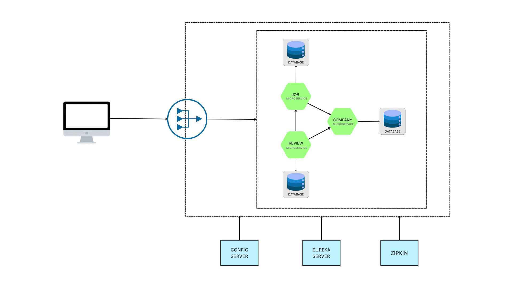

# JobList – Spring Boot Microservices Project

## Project Overview

**JobList** is a backend-focused, microservices-based job management platform designed using **Spring Boot** and **Spring Cloud**.
The system follows industry-standard microservice principles such as **service isolation**, **independent deployment**, and centralized infrastructure concerns including **service discovery**, **API gateway routing**, **externalized configuration**, and **distributed tracing**.

The application is **containerized using Docker** and is fully **Kubernetes-ready**, demonstrating modern backend engineering practices used in large-scale, production systems.


This project is designed as an **industry-level learning project** for backend/SDE roles.

---

## Microservices Overview

The system is composed of independent microservices, each responsible for a specific domain:

| Service | Description |
|------|------------|
| **Job Service** | Manages job listings (create, update, fetch jobs) |
| **Company Service** | Manages company details |
| **Review Service** | Handles company reviews |
| **API Gateway** | Single entry point for all clients |
| **Config Server** | Centralized configuration management |
| **Service Registry (Eureka)** | Service discovery |
| **Zipkin** | Distributed tracing |

---

## Architecture



```
Client
   │
   ▼
API Gateway (Spring Cloud Gateway)
   │
   ├── Job Service ---> Database
   ├── Company Service ---> Database
   └── Review Service ---> Database

Service Discovery → Eureka Server
Config Management → Spring Cloud Config Server
Tracing → Zipkin
```

---

## Tech Stack

### Backend
- Java 21
- Spring Boot
- Spring Data JPA
- Spring Cloud (Gateway, Eureka, Config)
- OpenFeign

### Messaging
- RabbitMQ

### Database
- PostgreSQL (Database per service)

### DevOps & Cloud
- Docker & Docker Compose
- Kubernetes (manifests included)
- Zipkin (Distributed Tracing)

### Tools
- pgAdmin
- Postman

---

## Communication Patterns

### Synchronous Communication
- **OpenFeign** for service-to-service REST calls
- Example: Company Service fetching average rating from Review Service

### Asynchronous Communication

- **RabbitMQ** (Event-Driven Architecture)
- Review Service publishes events
- Company Service consumes events to update ratings

---

## Key Features

- ✅ Microservices architecture
- ✅ API Gateway with route-based forwarding
- ✅ Centralized configuration using Config Server
- ✅ Service registration & discovery using Eureka
- ✅ Database per service
- ✅ Distributed tracing with Zipkin
- ✅ Dockerized microservices
- ✅ Kubernetes deployment-ready

---

## Dockerized Services

#### All services are fully containerized:

- Job Service
- Company Service
- Review Service
- Gateway
- Eureka Server
- Config Server
- RabbitMQ
- PostgreSQL
- Zipki
---
## Project Structure

```
├── company
│   ├── .mvn
│   │   └── wrapper
│   │       └── maven-wrapper.properties
│   ├── src
│   │   ├── main
│   │   │   ├── java
│   │   │   │   └── com
│   │   │   │       └── nirmalravidas
│   │   │   │           └── company
│   │   │   │               ├── controller
│   │   │   │               │   └── CompanyController.java
│   │   │   │               ├── model
│   │   │   │               │   └── Company.java
│   │   │   │               ├── repository
│   │   │   │               │   └── CompanyRepository.java
│   │   │   │               ├── service
│   │   │   │               │   ├── CompanyService.java
│   │   │   │               │   └── CompanyServiceImpl.java
│   │   │   │               └── CompanyApplication.java
│   │   │   └── resources
│   │   │       ├── application-docker.properties
│   │   │       ├── application-k8s.properties
│   │   │       └── application.properties
│   │   └── test
│   │       └── java
│   │           └── com
│   │               └── nirmalravidas
│   │                   └── company
│   │                       └── CompanyApplicationTests.java
│   ├── .gitattributes
│   ├── .gitignore
│   ├── mvnw
│   ├── mvnw.cmd
│   └── pom.xml
├── config-server
│   ├── .mvn
│   │   └── wrapper
│   │       └── maven-wrapper.properties
│   ├── src
│   │   ├── main
│   │   │   ├── java
│   │   │   │   └── com
│   │   │   │       └── nirmalravidas
│   │   │   │           └── config_server
│   │   │   │               └── ConfigServerApplication.java
│   │   │   └── resources
│   │   │       ├── application-docker.properties
│   │   │       └── application.properties
│   │   └── test
│   │       └── java
│   │           └── com
│   │               └── nirmalravidas
│   │                   └── config_server
│   │                       └── ConfigServerApplicationTests.java
│   ├── .gitattributes
│   ├── .gitignore
│   ├── mvnw
│   ├── mvnw.cmd
│   └── pom.xml
├── gateway
│   ├── .mvn
│   │   └── wrapper
│   │       └── maven-wrapper.properties
│   ├── src
│   │   ├── main
│   │   │   ├── java
│   │   │   │   └── com
│   │   │   │       └── nirmalravidas
│   │   │   │           └── gateway
│   │   │   │               └── GatewayApplication.java
│   │   │   └── resources
│   │   │       ├── application-docker.properties
│   │   │       ├── application-k8s.properties
│   │   │       └── application.properties
│   │   └── test
│   │       └── java
│   │           └── com
│   │               └── nirmalravidas
│   │                   └── gateway
│   │                       └── GatewayApplicationTests.java
│   ├── .gitattributes
│   ├── .gitignore
│   ├── mvnw
│   ├── mvnw.cmd
│   └── pom.xml
├── init
│   └── init.sql
├── job
│   ├── .mvn
│   │   └── wrapper
│   │       └── maven-wrapper.properties
│   ├── src
│   │   ├── main
│   │   │   ├── java
│   │   │   │   └── com
│   │   │   │       └── nirmalravidas
│   │   │   │           └── job
│   │   │   │               ├── clients
│   │   │   │               │   ├── CompanyClient.java
│   │   │   │               │   └── ReviewClient.java
│   │   │   │               ├── config
│   │   │   │               │   └── AppConfig.java
│   │   │   │               ├── controller
│   │   │   │               │   └── JobController.java
│   │   │   │               ├── dto
│   │   │   │               │   └── JobDTO.java
│   │   │   │               ├── external
│   │   │   │               │   ├── Company.java
│   │   │   │               │   └── Review.java
│   │   │   │               ├── mapper
│   │   │   │               │   └── JobMapper.java
│   │   │   │               ├── model
│   │   │   │               │   └── Job.java
│   │   │   │               ├── repository
│   │   │   │               │   └── JobRepository.java
│   │   │   │               ├── service
│   │   │   │               │   ├── JobService.java
│   │   │   │               │   └── JobServiceImpl.java
│   │   │   │               └── JobApplication.java
│   │   │   └── resources
│   │   │       ├── application-docker.properties
│   │   │       ├── application-k8s.properties
│   │   │       └── application.properties
│   │   └── test
│   │       └── java
│   │           └── com
│   │               └── nirmalravidas
│   │                   └── job
│   │                       └── JobApplicationTests.java
│   ├── .gitattributes
│   ├── .gitignore
│   ├── mvnw
│   ├── mvnw.cmd
│   └── pom.xml
├── k8s
│   ├── bootstrap
│   │   ├── company
│   │   │   ├── deployment.yaml
│   │   │   └── service.yaml
│   │   ├── job
│   │   │   ├── deployment.yaml
│   │   │   └── service.yaml
│   │   └── review
│   │       ├── deployment.yaml
│   │       └── service.yaml
│   ├── gateway
│   │   ├── deployment.yaml
│   │   └── service.yaml
│   ├── services
│   │   ├── postgres
│   │   │   ├── configmap-init.yaml
│   │   │   ├── configmap.yaml
│   │   │   ├── service.yaml
│   │   │   └── statefulset.yaml
│   │   └── zipkin
│   │       ├── zipkin-deployment.yaml
│   │       └── zipkin-service.yaml
│   └── namespace.yaml
├── pgadmin
│   └── servers.json
├── README.md
├── review
│   ├── .mvn
│   │   └── wrapper
│   │       └── maven-wrapper.properties
│   ├── src
│   │   ├── main
│   │   │   ├── java
│   │   │   │   └── com
│   │   │   │       └── nirmalravidas
│   │   │   │           └── review
│   │   │   │               ├── controller
│   │   │   │               │   └── ReviewController.java
│   │   │   │               ├── model
│   │   │   │               │   └── Review.java
│   │   │   │               ├── repository
│   │   │   │               │   └── ReviewRepository.java
│   │   │   │               ├── service
│   │   │   │               │   ├── ReviewService.java
│   │   │   │               │   └── ReviewServiceImpl.java
│   │   │   │               └── ReviewApplication.java
│   │   │   └── resources
│   │   │       ├── application-docker.properties
│   │   │       ├── application-k8s.properties
│   │   │       └── application.properties
│   │   └── test
│   │       └── java
│   │           └── com
│   │               └── nirmalravidas
│   │                   └── review
│   │                       └── ReviewApplicationTests.java
│   ├── .gitattributes
│   ├── .gitignore
│   ├── mvnw
│   ├── mvnw.cmd
│   └── pom.xml
├── service-registry
│   ├── .mvn
│   │   └── wrapper
│   │       └── maven-wrapper.properties
│   ├── src
│   │   ├── main
│   │   │   ├── java
│   │   │   │   └── com
│   │   │   │       └── nirmalravidas
│   │   │   │           └── service_registry
│   │   │   │               └── ServiceRegistryApplication.java
│   │   │   └── resources
│   │   │       └── application.properties
│   │   └── test
│   │       └── java
│   │           └── com
│   │               └── nirmalravidas
│   │                   └── service_registry
│   │                       └── ServiceRegistryApplicationTests.java
│   ├── .gitattributes
│   ├── .gitignore
│   ├── mvnw
│   ├── mvnw.cmd
│   └── pom.xml
└── docker-compose.yml

```

---

## Configuration Management

All application configurations are managed via **Spring Cloud Config Server**.

Example:

```properties
spring.application.name=job-service
spring.config.import=optional:configserver:http://localhost:8080
```

---

## API Gateway Routes (Example)

```

# Company Service
spring.cloud.gateway.server.webflux.routes[0].id=company_service
spring.cloud.gateway.server.webflux.routes[0].uri=lb://COMPANY-SERVICE:8081
spring.cloud.gateway.server.webflux.routes[0].predicates[0]=Path=/api/companies/**

# Job Service
spring.cloud.gateway.server.webflux.routes[1].id=job_service
spring.cloud.gateway.server.webflux.routes[1].uri=lb://JOB-SERVICE:8082
spring.cloud.gateway.server.webflux.routes[1].predicates[0]=Path=/api/jobs/**

# Review Service
spring.cloud.gateway.server.webflux.routes[2].id=review_service
spring.cloud.gateway.server.webflux.routes[2].uri=lb://REVIEW-SERVICE:8082
spring.cloud.gateway.server.webflux.routes[2].predicates[0]=Path=/api/reviews/**

```

Now all services are accessible through a **single base URL**:

```
http://localhost:8084/api/jobs
http://localhost:8084/api/companies
http://localhost:8084/api/reviews
```

---

## Docker Setup

### Build images

```bash
./mvnw spring-boot:build-image -Dspring-boot.build-image.imageName=nirmalravidas/company
./mvnw spring-boot:build-image -Dspring-boot.build-image.imageName=nirmalravidas/job
./mvnw spring-boot:build-image -Dspring-boot.build-image.imageName=nirmalravidas/review
./mvnw spring-boot:build-image -Dspring-boot.build-image.imageName=nirmalravidas/gateway
./mvnw spring-boot:build-image -Dspring-boot.build-image.imageName=nirmalravidas/service-registry
./mvnw spring-boot:build-image -Dspring-boot.build-image.imageName=nirmalravidas/config-server
```

### Run using Docker Compose

```bash
docker compose up -d
```

---

## Kubernetes Deployment

Each microservice has:

- Deployment YAML
- Service YAML

Start Minikube:
```
minikube start
```

Create pods:

```
kubectl craete namespace joblist
```

Create pods:

```bash
kubectl apply -f k8s/services/postgres/
kubectl apply -f k8s/services/zipkin/
kubectl apply -f k8s/bootstrap/company/
kubectl apply -f k8s/bootstrap/job/
kubectl apply -f k8s/bootstrap/review/
kubectl apply -f k8s/gateway/
```

Check status:

```bash
kubectl get pods
kubectl get services
```

---

## Sample JSON (Postman)

#### Create Company
```json

{
  "name": "Test Company",
  "description": "Test Company Description"
}

```

#### Create Job
```json
{
    "title": "Test Job",
    "description": "Test Job Description",
    "minSalary": "30000",
    "maxSalary": "1000000",
    "location": "Test Job Location",
    "companyId": 3
}
```
#### Create Review
```json
{
    "title": "Test Review",
    "description": "Test Description",
    "rating" : 5.3
}
```

---

## Distributed Tracing (Zipkin)

- Tracks request flow across microservices
- Helps debug latency and failures

Access Zipkin UI:

```
http://localhost:9411
```

---

## Learning Outcomes

- Real-world microservices communication
- API Gateway pattern
- Service discovery & load balancing
- Config externalization
- Docker + Kubernetes basics
- Backend system design understanding


